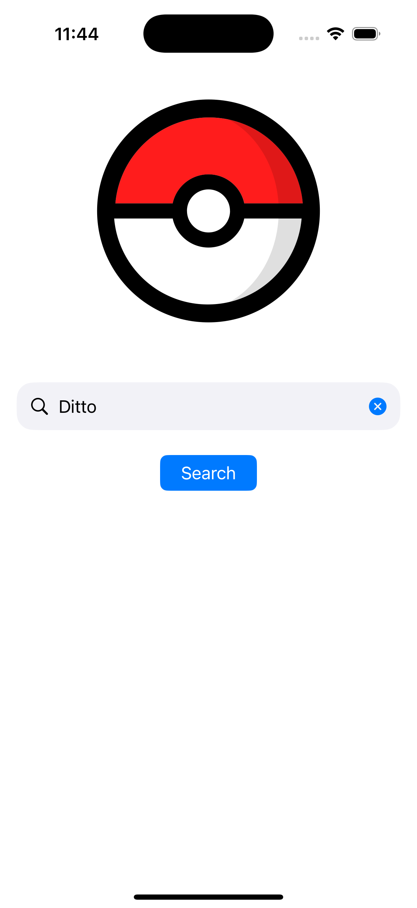
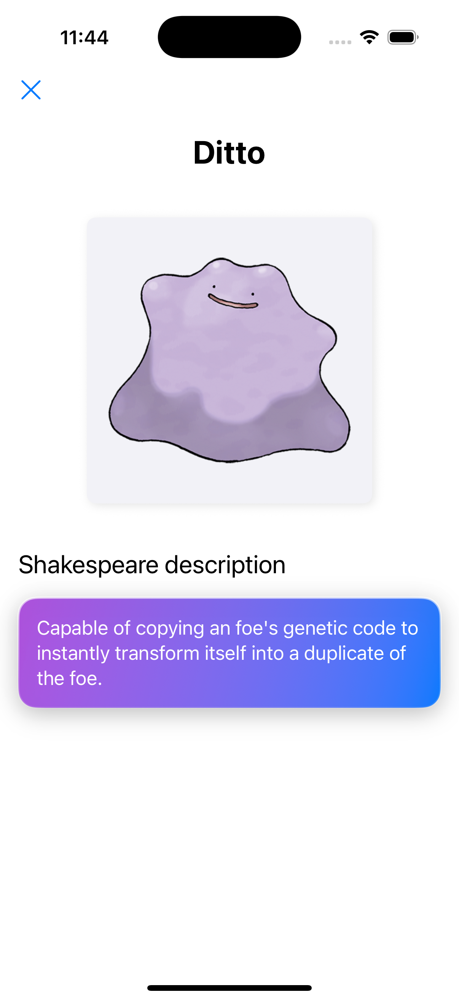

# TruePokemon Sample App

A sample iOS application that demonstrates how to use the TruePokemonSDK to display Pokémon information with their descriptions translated into Shakespearean style.

## App Screenshots

<div align="center">
  <p float="left">
    
     
  </p>
</div>

## Features

- 🔍 Search for Pokémon by name
- 🖼️ Display Pokémon sprites using the SDK's SpriteView component
- 📜 Show Shakespearean descriptions using the SDK's ShakespeareView component
- ⚠️ Handle and display user-friendly error messages

## Requirements

- iOS 15.0+
- Swift 5.5+
- Xcode 14.0+
- [Tuist](https://tuist.io) for project management

## Project Management with Tuist

This project is managed using [Tuist](https://tuist.io), a tool that helps with maintaining Xcode projects. Tuist makes it easier to define, generate, and update the project structure.

### Installing Tuist

If you don't have Tuist installed, you can install it using:

```bash
curl -Ls https://install.tuist.io | bash
```

### Tuist Commands

In the project root directory, you can use the following Tuist commands:

- Install the dependencies
  ```bash
  tuist install
  ```

- Generate the project:
  ```bash
  tuist generate
  ```

  (You can also use `sh setup.sh` command to install dependencies and generate the xcode project)

- Edit the project definition:
  ```bash
  tuist edit
  ```

### Project Structure

The project structure is defined in the `Project.swift` file, which contains all the configuration for targets, dependencies, and resources. Tuist uses this file to generate the Xcode project.

## Getting Started

### Installation

1. Clone the repository
   ```bash
   git clone https://github.com/Zeno995/TruePokemon.git
   ```

2. Generate the project using Tuist(using the setup script)
   ```bash
   cd TruePokemon/Sample
   sh setup.sh
   ```

3. Select the `TruePokemonSampleApp` target and an iOS simulator or device

4. Run the app!

## App Architecture

The sample app follows the MVVM (Model-View-ViewModel) architectural pattern and is built using SwiftUI.

### Key Components

#### Views

- **SearchView**: The main screen where users can search for Pokémon by name
- **PokemonDetailView**: Displays the Pokémon details including sprite and Shakespearean description

#### ViewModels

- **SearchViewModel**: Manages the business logic for searching Pokémon
- **PokemonDetailViewModel**: Manages the business logic for displaying Pokémon details

#### Services

- **TruePokemonLayer**: A service layer that encapsulates the SDK usage and provides a simplified interface for the app's views

### Data Flow

1. User enters a Pokémon name in the `SearchView`
2. `SearchViewModel` verifies if the Pokémon exists using the SDK's `verifyPokemon` method
3. If the Pokémon exists, a `PokemonDetailViewModel` is created and the `PokemonDetailView` is shown
4. `PokemonDetailView` uses the SDK's `SpriteView` and `ShakespeareView` components to display the Pokémon data

### Error Handling

The app displays specific error messages when:
- The entered Pokémon name doesn't exist
- Network errors occur during data loading
- Other unexpected errors happen

## Dependencies

- **TruePokemonSDK**: The main SDK providing services and UI components for interacting with Pokémon and Shakespeare APIs
- **Nimble**: Framework for better test reading
